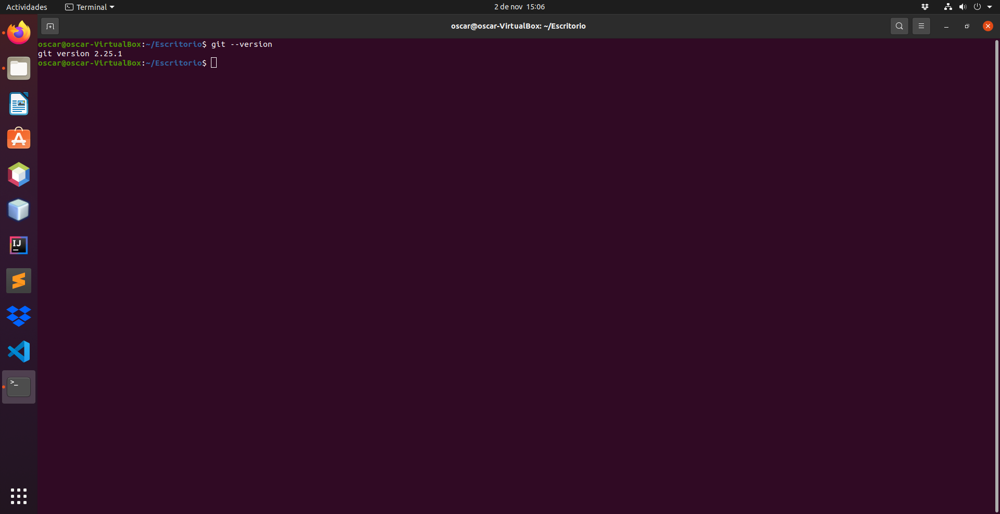

# Instalación de Git en linux


## Instalación de Git con paquetes predeterminados 
Es probable que Git ya esté instalado en el servidor Ubuntu 20.04. Puede confirmar que ese es el caso de su servidor con el siguiente comando:

```
  git --version
```
Si se optiene algo parecido a lo siguiente es que ya tenemos instalado Git.


```
  git version 2.25.1
```


Si no tenemos Git instalado utilizamos el siguiente comando;

```
  sudo apt update
```


después instalamos git, con el comando:

```
  sudo apt install git
```


para confirmar que se instaló correctamente usamos

```
  git --version 
```
  
que nos debería dar algo parecido a esto;

```
  git versión 2.25.1
```


## Instalación de Git desde la fuente

Si busca un método más flexible para instalar Git, puede optar por compilar el software desde la fuente, lo cual explicaremos en esta sección. Esto toma más tiempo y no se mantendrá en su administrador de paquetes, pero le permitirá descargar la versión más reciente y le brindará mayor control sobre las opciones que incluya si quiere personalizarlo.

Para ello verificamos la versión que tenemos de Git
 
 ```
  git --version 
```




Antes de comenzar, debe instalar el software necesario para Git. Todo se encuentra disponible en los repositorios predeterminados, de modo que podemos actualizar nuestro índice local de paquetes y luego instalar los paquetes pertinentes.

```
  sudo apt update
  sudo apt install libz-dev libssl-dev libcur14-gnutls-dev libexpat1-dev gettext cmake gcc
```


Tras haber instalado las dependencias necesarias, cree un directorio temporal y vaya a él. Aquí es donde descargaremos nuestro tarball de Git.

```
  mkdir tmp
  cd /tmp
```


Desde el sitio web del proyecto Git, podemos navegar a la lista de tarball disponible en https://mirrors.edge.kernel.org/pub/software/scm/git/ y descargar la versión que quiera utilizar.

```
  curl -o git.tar.gz https://mirrors.edge.kernel.org/pub/software/scm/git/git-2.29.3.tar.gz
```


Como no tenemos instalado curl, debemos primero intalarlo.


Una vez instaldo curl y ejecutado el código anterior, descomprimimos el archivo tarball:
	
  ```
  Tar –zxf git.tar.gz
```

Vamos al nuevo directorio de Git:
Y creamos el paquete para instalarlo escribiendo dos comandos:
	
 ```
  make prefix=/usr/local all
```


```
  sudo make prefix=/usr/local install
```


sustituimos el proceso de Shell para que se utilice la versión de Git que acabamos de instalar:

```
  exec bash
```

una vez realizado, comprobamos que se instaló correctamente. 
 	
 ```
  git --version
```
  

  

## Configuración de Git

Una vez que esté satisfecho con la versión de Git, debería configurar Git de modo que los mensajes de confirmación que genere contengan la información correcta y lo respalden a medida que compile su proyecto de software.
Esta configuración es posible si aplicamos el comando git config. Específicamente, debemos proporcionar nuestro nombre y nuestra dirección de correo electrónico debido a que Git inserta esta información en cada confirmación que hacemos. Podemos añadir esta información escribiendo lo siguiente:

 ```
	git config --global user.name “Your Name”
	git config --global user.email youremail@domain.com
```

podemos ver los elementos creados con el siguiente comando 
	
   ```
  git config --list
```


La información que ingresa se almacena en el archivo de configuración de Git. Tendrá la opción de editarlo manualmente con el editor de texto que prefiera (en este tutorial utilizaremos nano) como se muestra a continuación:
 

```
  nano  ~/.gitconfig
  ~/.gitconfig contents
  [user]
  name = Your Name
  email = youremail@domain.com (Un correo personal que indique que es el creador de la tarea)
```
 


