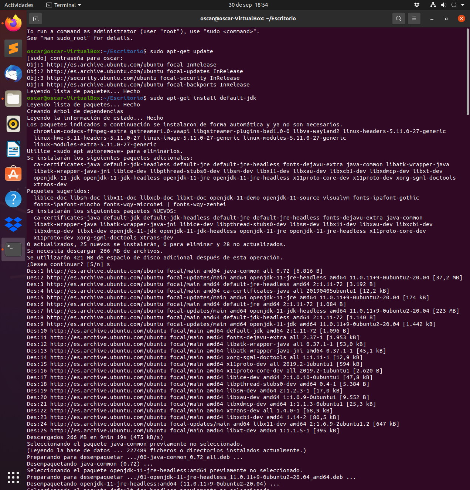
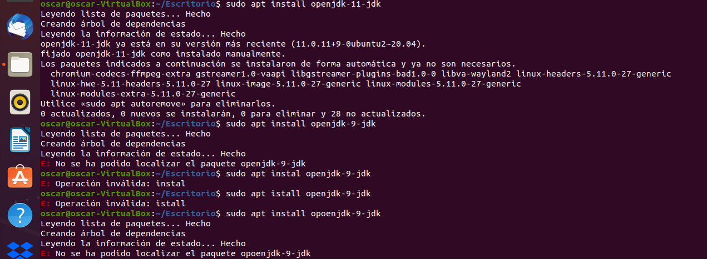
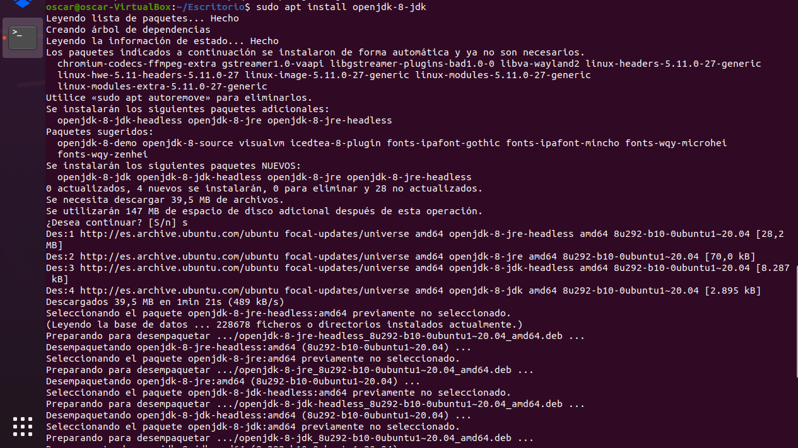
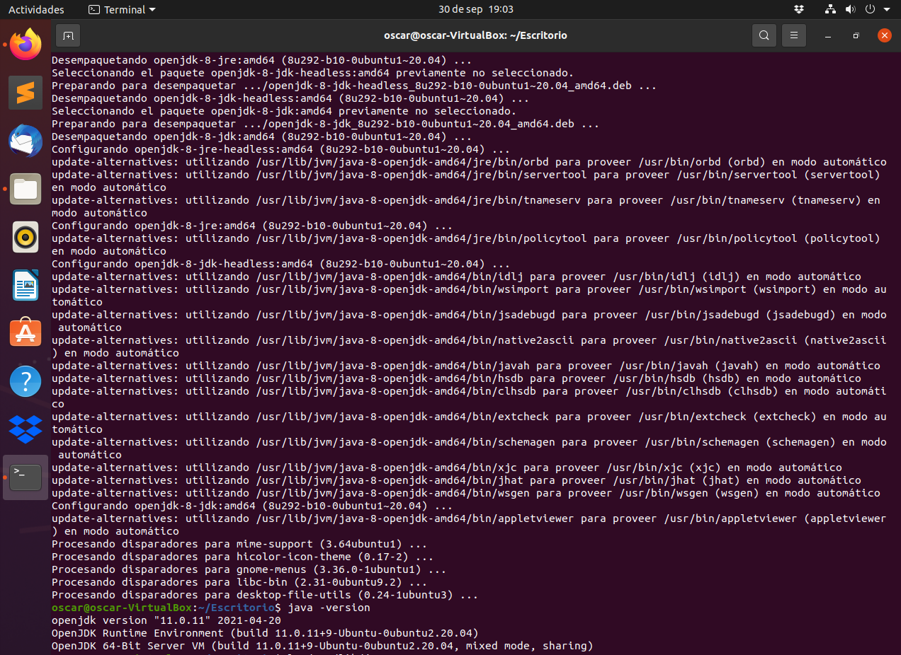
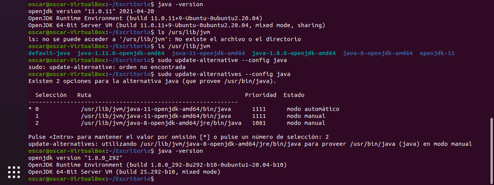

# Instalación de JDK


## ¿Cómo instalar Java en Ubuntu desde repositorios?

Actualizamos el sistema con:

```
  sudo apt-get update
```

e instalamos Java con este comando:

```
  sudo apt-get install default-jdk
```



En esta imagen vemos como se ejecutan los comandos anteriormente comentados. Podemos ver la ejecución de la instalación, una vez finalizada pasamos al siguiente comando 


comprobamos que tenemos instalado Java en nuestro sistema solo debemos de ejecutar:
```
  java --version
```

<div aling="center">

<div>


## ¿Cómo instalar una versión específica de Java?

Para instalar Ubuntu Java Open JDK utilizamos los siguientes comandos:
Para OpenJDK 11, 9 y 8 respectivamente:

   - 11
   ```
   sudo apt install openjdk-11-jdk
   ```
    - 9
   ```
   sudo apt install openjdk-9-jdk
   ```
    - 8
   ```
   sudo apt install openjdk-8-jdk
   ```




Vemos que al intentar la versión 9 nos da un fallo. Pasamos directamente a instalar la versión 8.



La versión que se debe de trabajar es la versión 8. Para ello verificaremos la versión de java que se esta ejecutando con la sentencia:

```console
  java --version
```




Efectivamente vemos que tenemos instalada la versión 11.0.11, como no se ejecuta la versión 8 que la que queremos debemos configurar las variables de entorno


## Configuración de las variables de entorno

 El siguiente paso consiste en establecer  las variables de entorno. Es necesario porque cuando se usa Java, Linux necesita saber dónde está ubicado el programa para ejecutarlo y qué versión de Java usar de forma predeterminada. Para modificar esto, usaremos el editor de texto nano. Primero, abra el archivo en Nano.

### Listar las versiones de OpenJDK instaladas

 Ejecuta el siguiente comando para verificar que se han descargado las diferentes versiones de OpenJDK.

```console
 ls /usr/lib/jvm
```


### Actualización de las variables de entorno

 Edita y modifica el fichero profile, con los comandos:

```console
sudo update-alternatives --config java
```
 y selecciona la version _8_.




Vemos como se ejecutaron los comandos y modificamos las variables, como resultados tenemos la versión 8 de java. 
