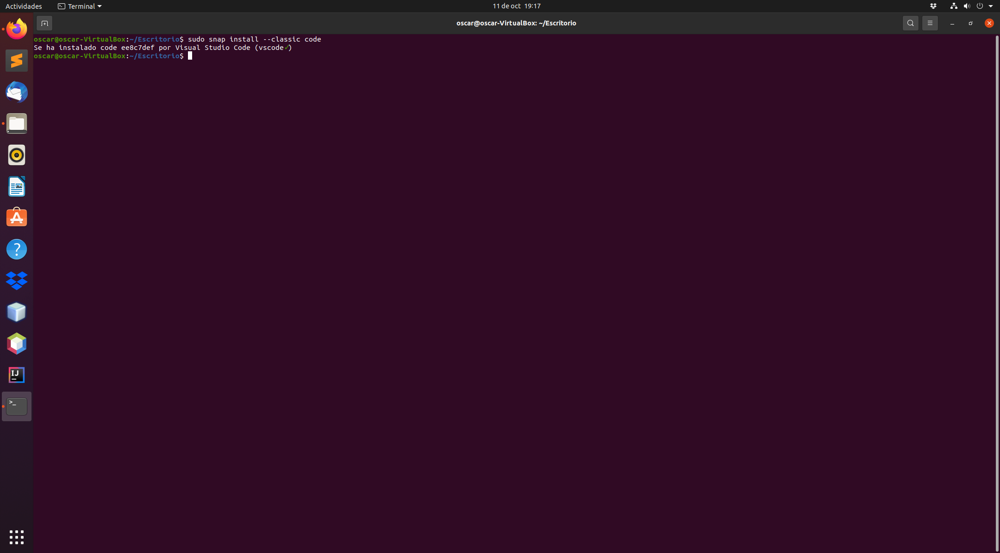
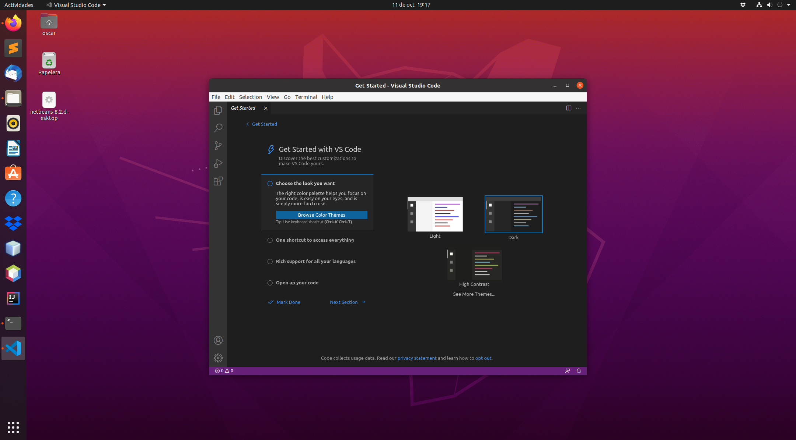
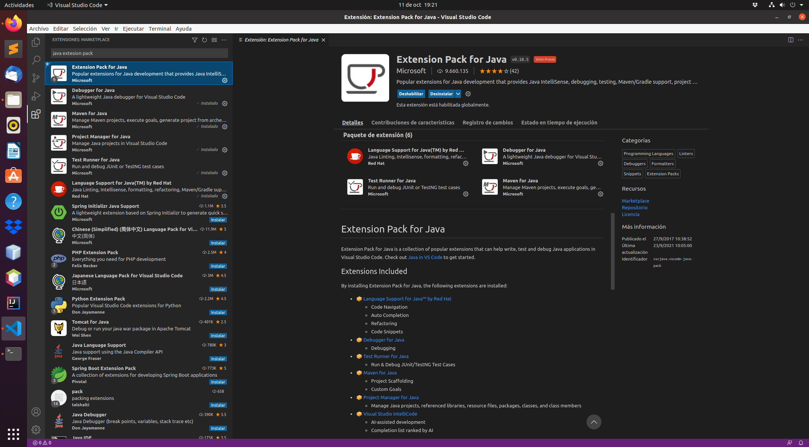
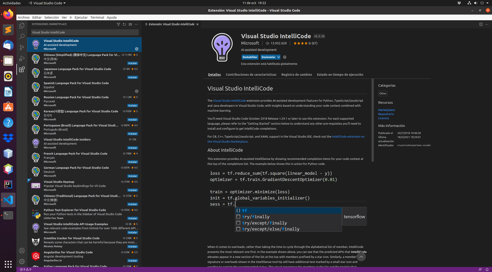
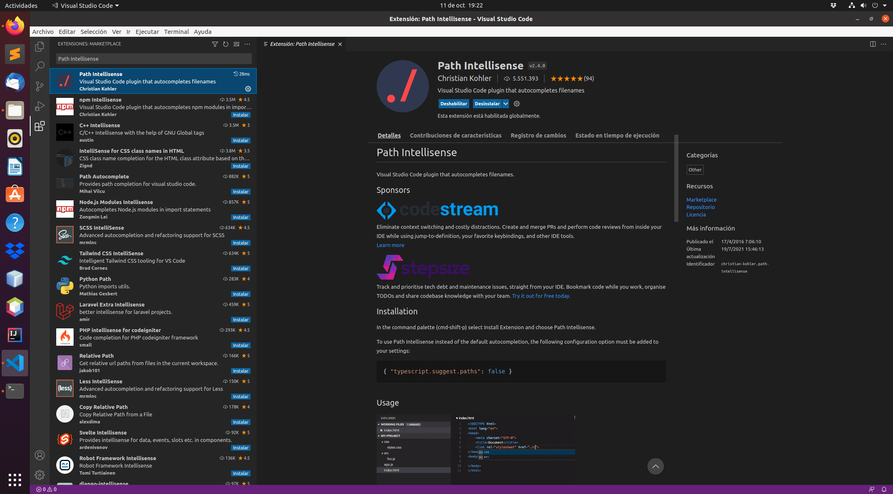
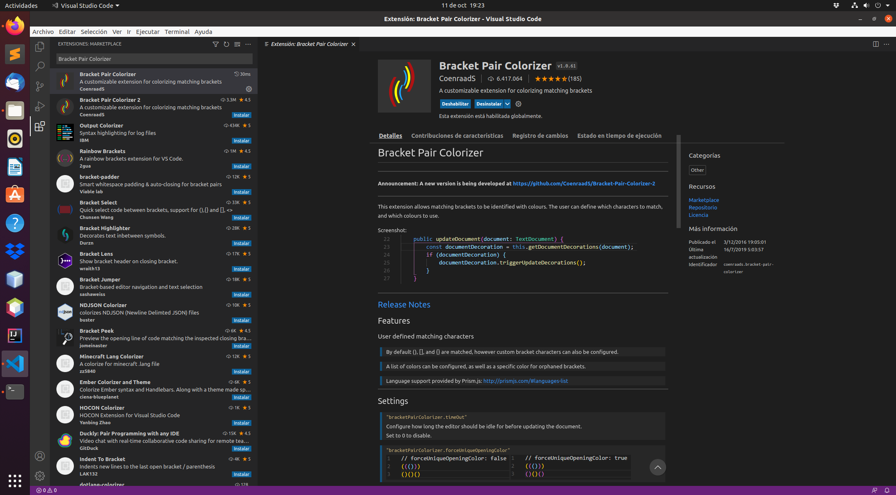
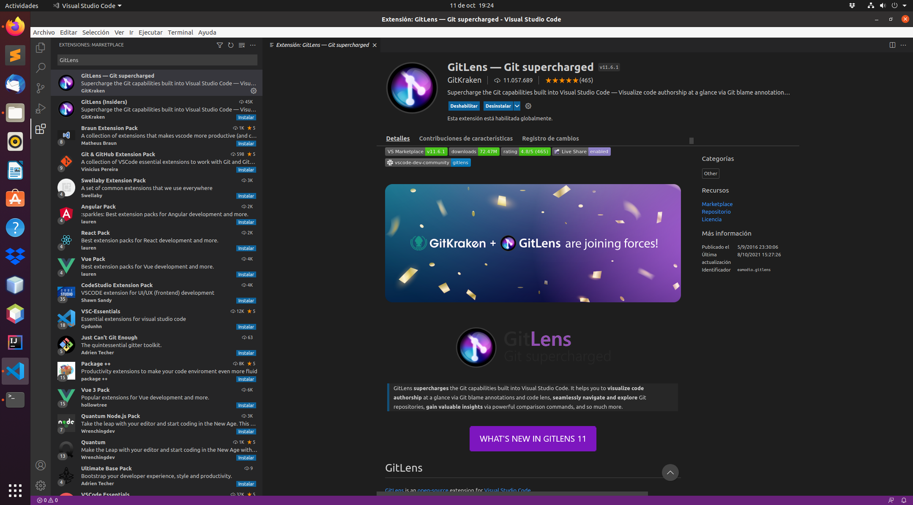
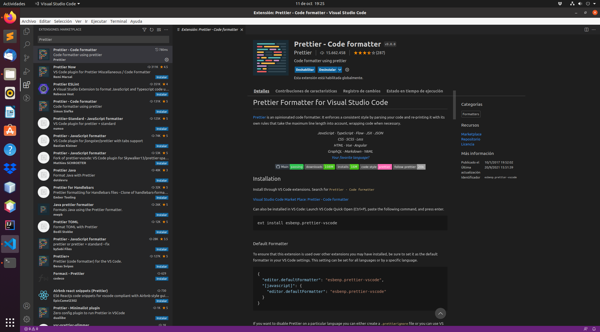
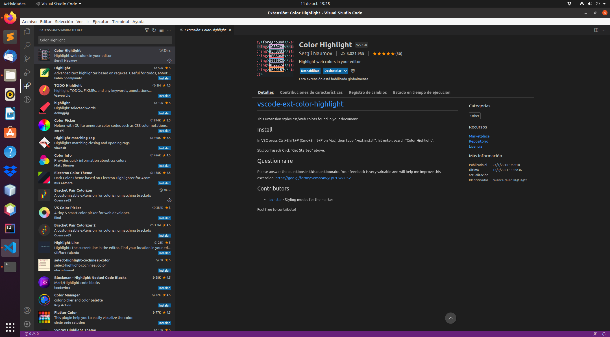
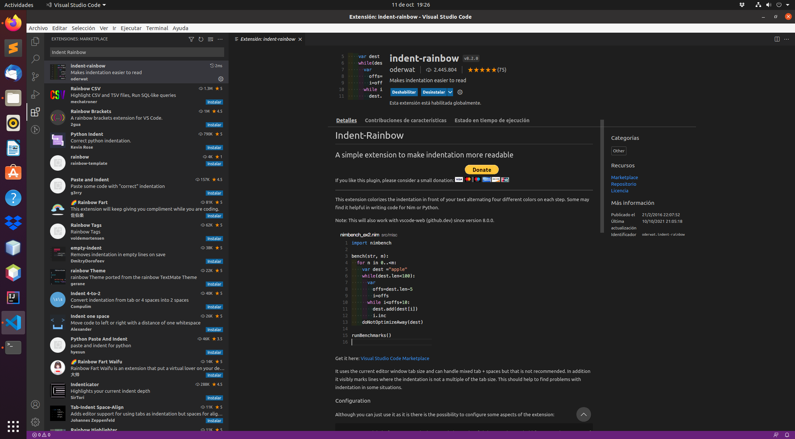

<div align="justify">

# Instalación del IDE VS-Code

<div align="center">
  
</div>

## Instalación

  Para instalar VS-Code, ejecute el siguiente comando:

```console
sudo snap install --classic code
```

  Esto debería llevar unos minutos y debería continuar sin problemas.
  
  
  

## Lanzamiento de VS-Code

  Para iniciar VS-Code en Ubuntu, use la aplicación para buscarlo (_Activities o Alt + F1_) como se muestra. Luego haga clic en el ícono de VS-Code.

  
  
 

### Extensiones Necesarias

#### Java Extension Pack

  Una vez instalado Visual Studio Code todavía hemos de realizar una serie de pasos antes de comenzar a trabajar. VS Code es un editor muy versátil, gracias a su diseño modular, podemos añadir soporte para JAVA mediante extensiones. Para facilitar más las cosas, disponemos de un __Java Extension Pack__, que contiene las extensiones más populares usadas por los desarrolladores JAVA:
  - Language Support for Java(TM) de Red Hat
  - Debugger for Java
  - Java Test Runner
  - Maven for Java
  - Java Dependency Viewer
  
  
  

##### Visual Studio IntelliCode

  Es una extensión que incorpora inteligencia artificial para ayudarte a codificar. Admite Python, JavaScript / TypeScript y Java.
  
  
  

##### Path Intellisense

  Esta extensión permite escribir fácilmente nombres de rutas de archivos.
  
  
  

##### Bracket Pair Colorizer

  Nos ayuda a ver más fácilmente el bloque de código que se encuentra entre los caracteres (), {}, [] trazando una línea. Permite configurar otros tipos de caracteres.
  
  
  

##### GitLens

  Sobrealimenta las capacidades de Git que ya se encuentran integradas en Visual Studio Code. Ayuda a visualizar el autor del código, navegar y explorar sin problemas los repositorios de Git, obtener información valiosa a través de potentes comandos de comparación y mucho más.

  
  
  
##### Prettier

  Herramienta que formatea el código automáticamente, esto permite despreocuparse de si nuestro código esta bien identado.
  
  
  

##### Color Highlight

  Facilita la visualización de los colores. Rodea el código hexadecimal del color en un rectángulo con el color elegido.
  
  
  

##### Indent Rainbow

  Esta extensión colorea la sangría frente a su texto alternando cuatro colores diferentes en cada paso, ayuda a visualizar el correcto indentado del código.
  
  
  
  
   [Pagina Principal](https://github.com/OscarDavid87/ETS-Entornos-de-desarrollo/blob/main/README.md)
