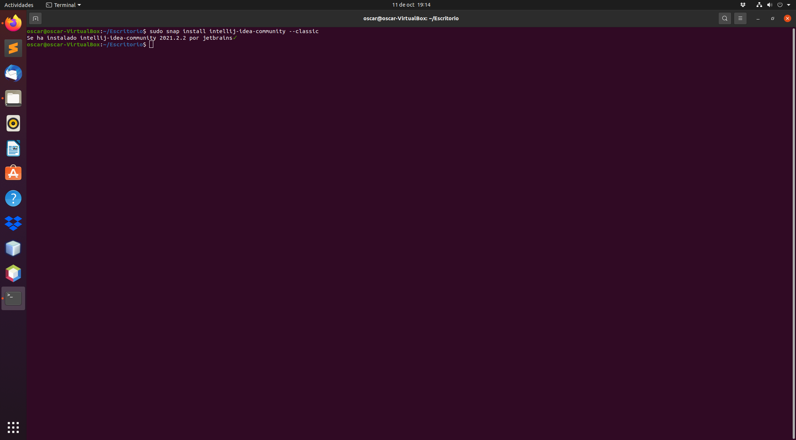

<div align="justify">

# Instalación del IDE IntelliJ IDEA

<div align="center">
  
</div>


## Instalación


  Para instalar la edición Community, ejecute el siguiente comando:

```console
sudo snap install intellij-idea-community --classic
```

  
  
 Esto debería llevar unos minutos y debería continuar sin problemas.

## Iniciar IntelliJ

  Para iniciar IntelliJ en Ubuntu, use la aplicación para buscarlo (_Activities o Alt + F1_) como se muestra. Luego haga clic en el ícono de IntelliJ.

  
 

 [Pagina Principal](https://github.com/OscarDavid87/ETS-Entornos-de-desarrollo)
