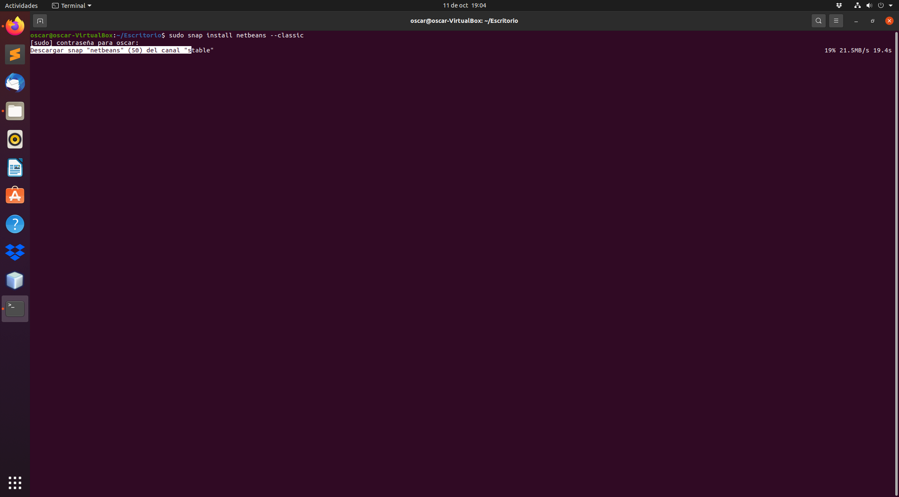
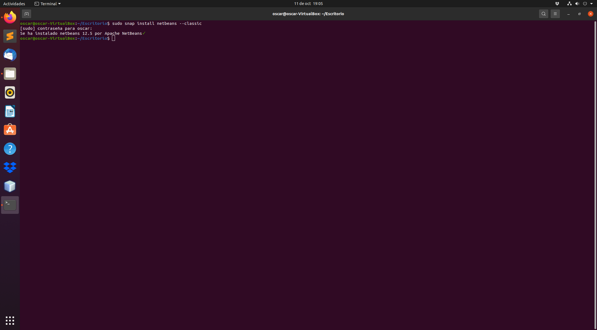
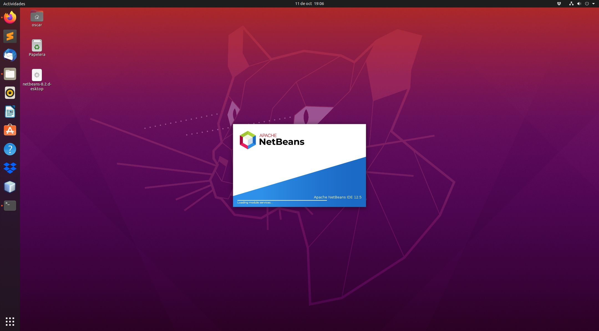

<div align="justify">

# Instalación del IDE Netbeans 12

<div align="center">
  
</div>


## Instalación

 
  Para instalar la edición Netbeans, ejecute el siguiente comando:

```console
sudo snap install netbeans --classic
```

  
  La instalación finalizará cuando veas el siguiente mensaje:

  ```console
  netbeans 12.5 from Apache NetBeans✓ installed
  ```
  
  

# Ejecutar Netbeans 12

  Ahora que Netbeans está instalado en su sistema Ubuntu, puede iniciarlo escribiendo netbeans en su terminal o haciendo clic en el icono de Netbeans ( Activities -> Netbeans ).

  Una vez que se cargue el IDE de Netbeans, se le presentará la página de inicio.

  
