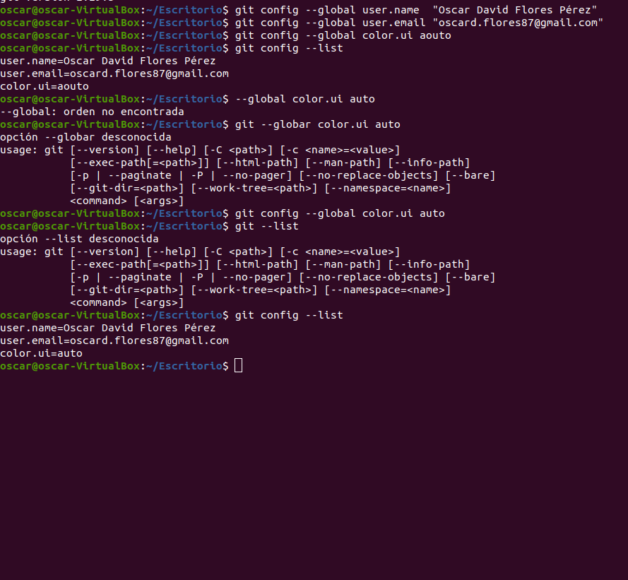
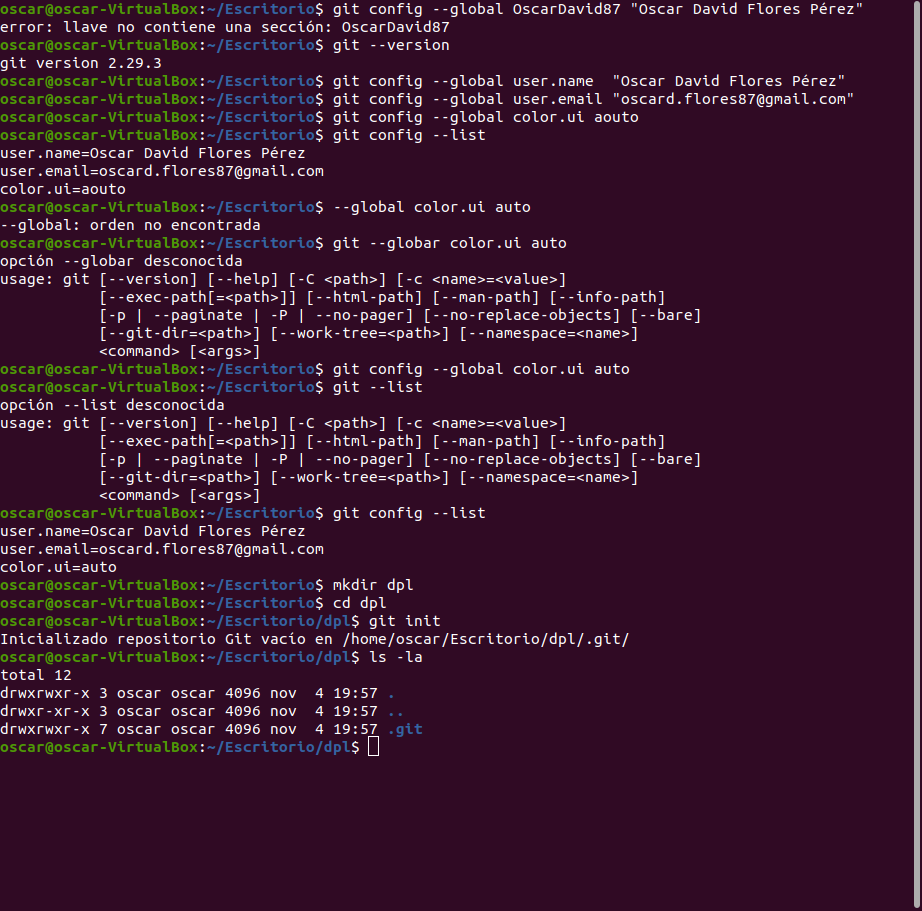
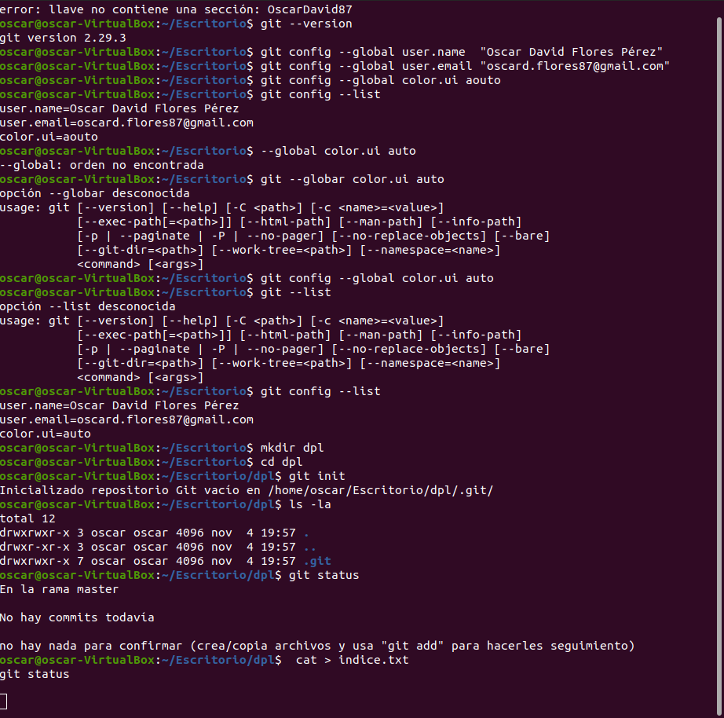
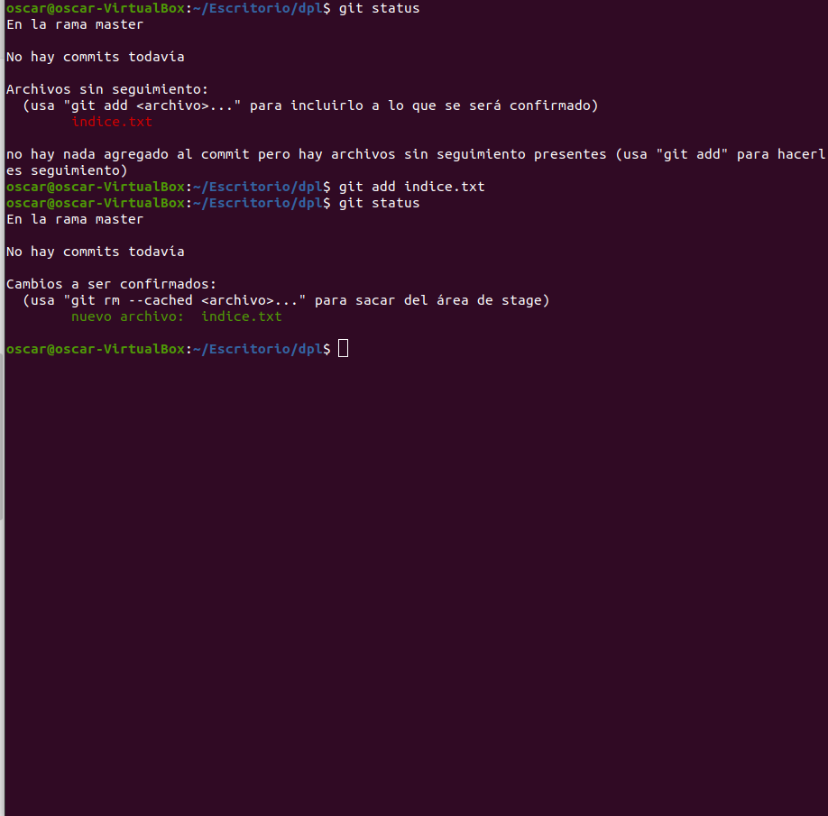
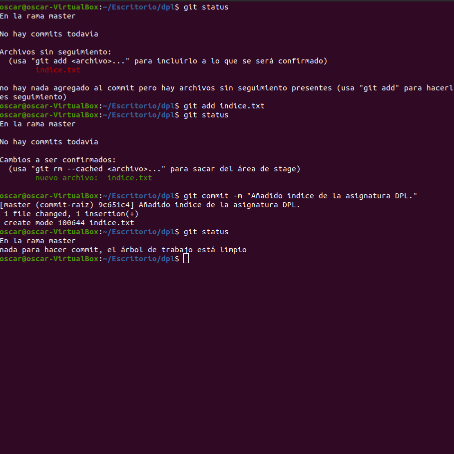
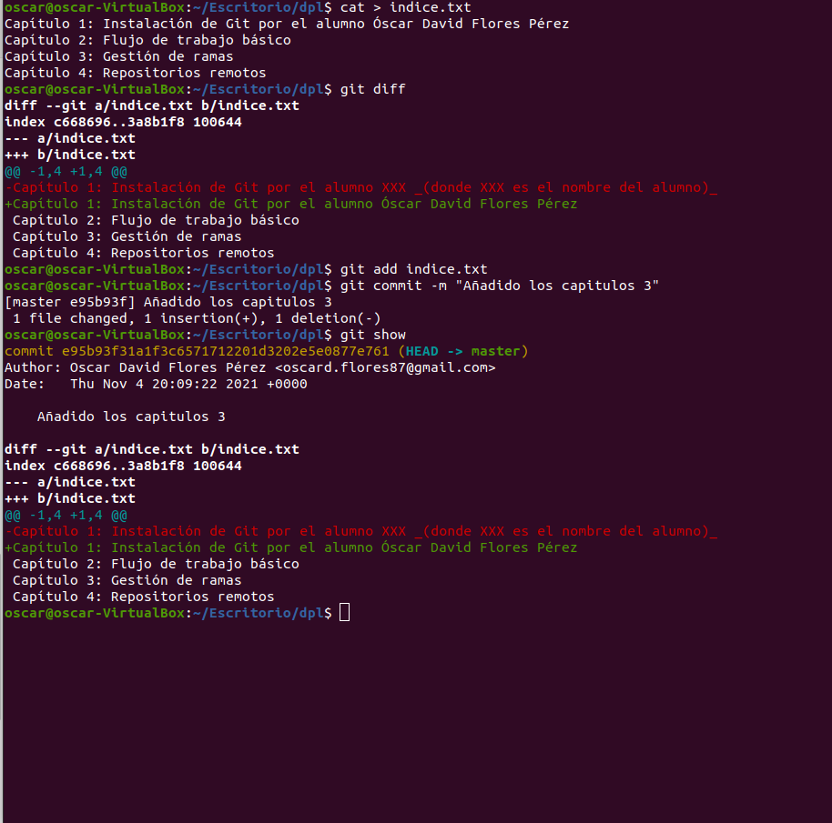
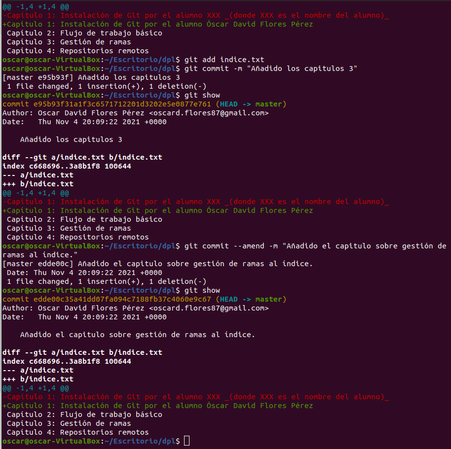

<div align="justify">
	
# Manipulación de repositorios en Git

## Configuración

Empezamos configurando el Git definiendo el nombre de usuario, correo electrónico y activar coloreado de salida:

```
	git config --global user.name "Your-Full-Name"
	git config --global user.email "your-email-address"
 	git config --global color.ui auto
 	git config --list

```



## Creación de un repositorio

```
	mkdir dpl
	cd dpl
	git init
	ls -la

```


## Comprobar el estado del repositorio

Comprobamos el estado del repositorio

```
	git status 
```


Creamos un fichero índice.txt que contenga:
	Capítulo 1: Instalación de Git por el alumno XXX
	Capítulo 2: Flujo de trabajo básico.

```
	cat > indice.txt
	Capítulo 1: Instalación de Git por el alumno XXX
	Capítulo 2: Flujo de trabajo básico
	Ctrl+D
```

Volvemos a comprobar el estado del repositorio

```
	git status 
```


Añadimos el fichero a la zona de intercambio temporal.


```
	git add índice.txt
```

y una vez más vemos el estatus del repositorio.

```
	git status 
```





## Realizando Commit´s.

Realizamos un commit con los últimos cambios agregando un mensaje y viendo el estado del repositorio.
git commit -m "Añadido índice de la asignatura DPL."

```
	git commit -m "Añadido índice de la asignatura DPL."
	git status

```



## Modificación de ficheros.
Cambiamos el fichero indece.txt para que tenga lo siguiente:
•	Capítulo 1: Instalación de Git por el alumno XXX (donde XXX es el nombre del alumno)
•	Capítulo 2: Flujo de trabajo básico
•	Capítulo 3: Gestión de ramas
•	Capítulo 4: Repositorios remotos

```
cat > indice.txt
Capítulo 1: Instalación de Git por el alumno XXX _(donde XXX es el nombre del alumno)_
Capítulo 2: Flujo de trabajo básico
Capítulo 3: Gestión de ramas
Capítulo 4: Repositorios remotos
Ctrl+D
git diff
git add indice.txt

```

Hacemos un commit

```
	git commit -m "Añadido los capitulos 3"
```




## Historial

Mostrar los cambios de la última versión del repositorio con respecto a la anterior.
Cambiar el mensaje del último commit por Añadido el capítulo sobre gestión de ramas al índice. 
Volver a mostrar los últimos cambios del repositorio. 

```
	git show
	git commit --amend -m "Añadido el capitulo sobre gestión de ramas al índice."
	git show
```




</div>

[Pagina Principal](https://github.com/OscarDavid87/ETS-Entornos-de-desarrollo/blob/main/README.md)
